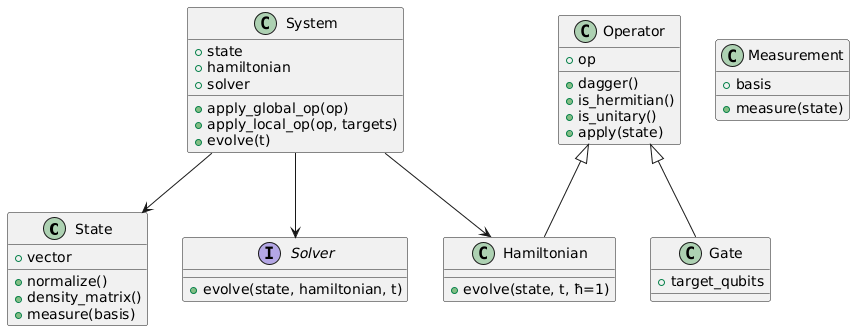

# QLab

This **repository** will be used to perform all computational simulations and calculations for the [Quantum photonics research](https://sites.google.com/view/quantum-computing-group/material). 

## Current project structure

The project right now contains this basic structure

```bash
.
├── README.md
├── bloch_sphere.py
├── docs
│   ├── REQS.md
│   ├── STRUCTURE.md
│   └── core
│       ├── QLab-core.png
│       └── class_diagram.txt
├── python
│   ├── __init__.py
│   ├── core
│   │   ├── gates.py
│   │   ├── operator.py
│   │   ├── qubit.py
│   │   ├── solver.py
│   │   └── system.py
│   ├── test.py
│   └── visualization
│       ├── __init__.py
│       └── bloch_sphere
│           ├── __init__.py
│           ├── bloch_api.py
│           └── gui.py
└── requirements.txt

7 directories, 18 files
```

This will be useful to representate and solve a great variety of quantum systems and apply operators to them. 

## Core description

A `core` directory is included in the project. This directory contains the **base classes** to represent quantum systems and it's necessary **operators/hamiltonians**.

This class diagram describes the **classes hierarchy**: 



## Bloch Sphere simulation

The project contains a **Bloch Sphere** simulation which consist on a **Qubit** mapped in a 3D space. 

A simulation in VPython is included in order to manipulate the **quantum system** and visualize how the **Bloch Sphere** changes after a **gate** (operator) is applied. 

### Aditional notes

* **VPython** framework was chosen because it's easier to make 3D simulations. The **GUI** is not planned to be developed with this framework.
* Currently, the visualization **does not** allow rotations, which have to be fixed.

